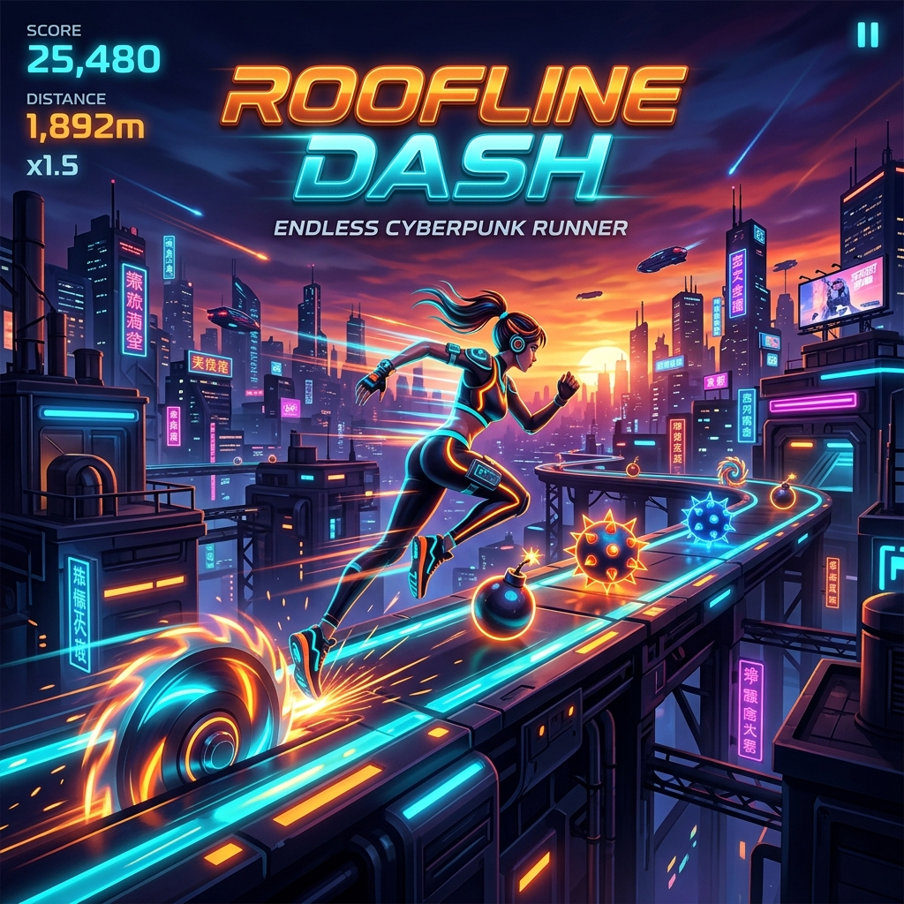

<p align="center">
  
</p>

<h1 align="center">🏃‍♂️ ROOFLINE DASH — 3D Endless Runner</h1>

<p align="center">
  <em>A fun game I created just to check my skills! 🎮✨</em>
</p>

<p align="center">
  
  
  
  
</p>

---

## 🎯 About

**Roofline Dash** is a high-performance **3D endless runner** game built entirely with **vanilla JavaScript** and **Three.js**. I built this game purely to challenge myself and push my skills in 3D web game development — from physics simulation and collision detection to asset management and UI design.

Run across rooftops, dodge deadly obstacles, earn credits, and see how far you can go! 🔥

---

## 🎮 Gameplay Features

| Feature | Description |
|---------|-------------|
| 🏗️ **3D Environment** | Fully rendered 3D world with dynamic lighting, shadows, and fog |
| 🎯 **3 Difficulty Modes** | **Easy** (chill run), **Medium** (balanced), **Hard** (extreme!) |
| 🧥 **Wardrobe System** | Unlock and equip different character skins |
| 💰 **Credits & Scoring** | Earn credits for dodging hazards, track high scores via `localStorage` |
| 🎭 **Animated Character** | Smooth sprint, jump, slide, and death animations |
| 💥 **Dynamic Hazards** | Bombs 💣, spinning saws 🔴, and spiky balls 🦔 — randomized every run |
| 🌳 **Environmental Props** | Trees, bushes, and rocks for immersive scenery |
| 🎨 **Glassmorphism UI** | Modern, premium HUD with frosted glass effects |

---

## 🕹️ Controls

| Action | Keyboard |
|--------|----------|
| ⬅️ Move Left | `A` or `Arrow Left` |
| ➡️ Move Right | `D` or `Arrow Right` |
| ⬆️ Jump | `W` or `Arrow Up` |
| ⬇️ Slide | `S` or `Arrow Down` |

---

## 🚀 How to Play

### Quick Start (Windows)
Simply double-click the **`Play Roofline Dash.bat`** file to launch the game in your browser!

### Manual Start
1. Clone this repository:
   ```bash
   git clone https://github.com/APPISETTYHARI/Roofline-Dash-3D-Runner.git
   cd Roofline-Dash-3D-Runner
   ```

2. Start a local server (any of these work):
   ```bash
   # Using Python
   python -m http.server 8000

   # Using Node.js
   npx serve .

   # Using PowerShell (included script)
   ./serve-game.ps1
   ```

3. Open your browser and navigate to `http://localhost:8000`

4. Click **START RUN** and enjoy! 🎉

---

## 📂 Project Structure

```
Roofline-Dash-3D-Runner/
├── index.html                  # Main game page
├── game.js                     # Core game engine & logic
├── styles.css                  # Premium glassmorphism UI
├── assets.js                   # Base64 encoded asset bundle
├── asset-data.js               # Asset data definitions
├── three.min.js                # Three.js library (r145)
├── three.module.js             # Three.js ES module
├── GLTFLoader.js               # GLTF model loader
├── GLTFLoader.legacy.js        # Legacy GLTF loader
├── GLTFLoader.r145.js          # r145 compatible loader
├── Play Roofline Dash.bat      # Quick-launch script (Windows)
├── serve-game.ps1              # PowerShell server script
├── build-assets.ps1            # Asset build pipeline
├── test-package.ps1            # Package testing script
├── banner.png                  # Game banner image
├── assets/                     # 69 GLTF/GLB 3D models
│   ├── Character.gltf          # Main player character
│   ├── Bomb.gltf               # Bomb hazard
│   ├── Hazard_Saw.gltf         # Spinning saw obstacle
│   ├── SpikyBall.gltf          # Spiky ball obstacle
│   ├── Tree.gltf               # Tree prop
│   ├── Bush.gltf               # Bush prop
│   ├── Rock_1.gltf             # Rock prop
│   └── ... (62 more models)
├── Textures/
│   └── colormap.png            # Texture atlas
├── utils/
│   └── BufferGeometryUtils.js  # Geometry utilities
├── DEVELOPER_HANDOFF.md        # Developer documentation
└── PROJECT_STATUS.md           # Project status tracker
```

---

## 🛠️ Tech Stack

- **Rendering Engine:** [Three.js](https://threejs.org/) (r145)
- **3D Models:** GLTF / GLB format with animations
- **UI Design:** Pure CSS with glassmorphism, gradient effects, and micro-animations
- **Typography:** Google Fonts (Outfit + Inter)
- **Storage:** `localStorage` for persistent high scores and credits
- **No Build Tools Required** — runs directly in the browser! ⚡

---

## 🎨 Game Design Highlights

- **Sunset Orange (#FFB347)** and **Cyber Blue (#00DBDE)** color palette
- **Frosted glass HUD panels** with backdrop blur
- **Pulsating START button** with glow animation
- **Smooth lane-switching** with `THREE.MathUtils.lerp`
- **Progressive difficulty** — speed increases the longer you survive
- **Physics-based jumping** with realistic gravity

---

## 📜 Why I Built This

> *"I created this game just to check my skills and have some fun along the way! It was a great exercise in learning Three.js, 3D physics, collision detection, and modern web UI design. Sometimes the best way to learn is to build something cool!"* 🚀

---

## 📄 License

This project is open source and available under the [MIT License](LICENSE).

---

<p align="center">
  Made with ❤️ and a lot of ☕ by <strong><a href="https://linkedin.com/in/appisettyhari">APPISETTY HARI</a></strong>
</p>
